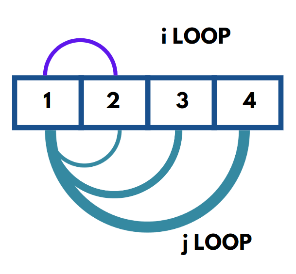
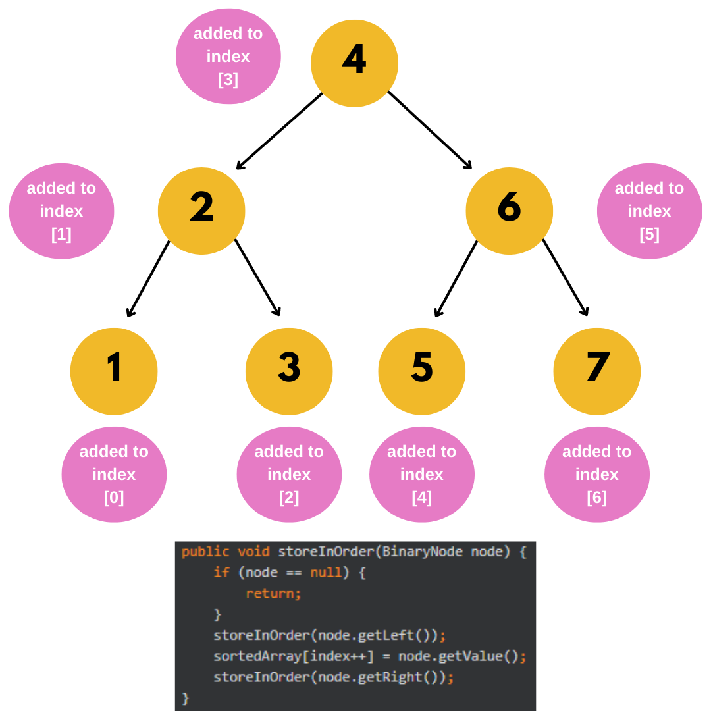
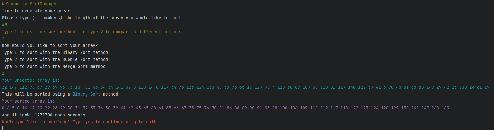
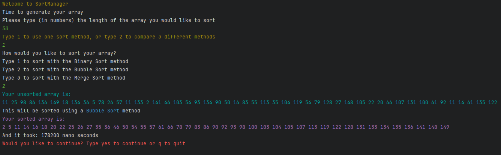
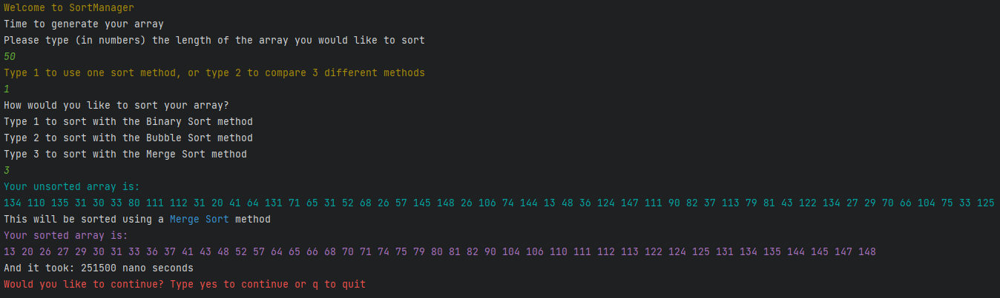
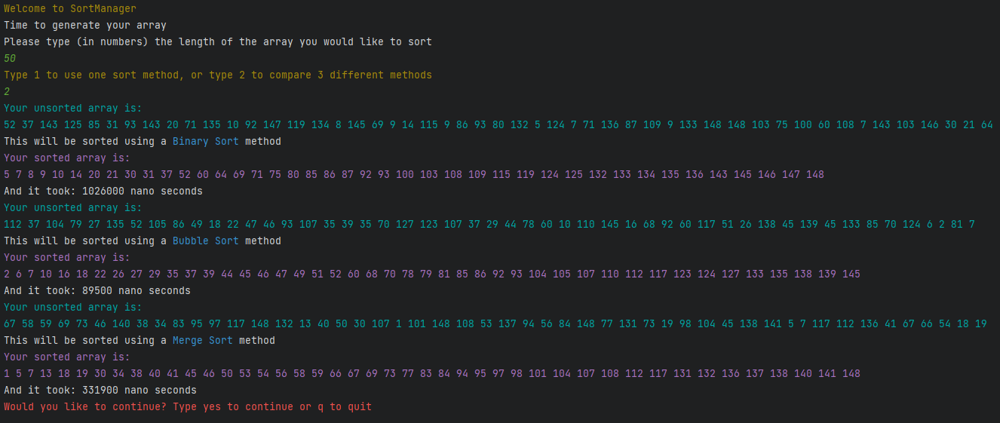

# Sort Manager

Sort Manager has multiple methods for sorting Arrays, including Bubble Sort and Merge Sort.

The user is able to set the length of the array that they would like to sort, and a random array is generated.
The user can then either select a sorting method to use, or compare all three sorting methods to each other.

All output is in the console, and is colour-coded to allow for easy viewing.


## Authors

- [@Kilmurray](https://www.github.com/MaddyKilmurray)


## Features

- Colourful console output to allow for easier reading
- Thoroughly tested and robust code
- Clear user journey through the program
- Code segments optimised for reuse in other projects


## Usage/Examples

### Display and Sort Manager

To implement a Model View Controller model, all user interaction takes place through the *DisplayManager* class. This class contains all methods which either take direct user input or print to the console for the user to view.

The *SortManager* class takes requests from the *DisplayManager* and implements a factory method to select the Sort method. Instances of the classes that extend the Sorter interface are stored in the SorterType enum, and a called through a factory method.

### Utility Classes

This project uses three utility classes

- ConsoleColours - this class is responsible for holding the colour values used when printing to console.
- DuplicateRemover - this class has only one method, and it takes an int array and converts it to a Set. A Set cannot hold duplicates, so when the Set is then converted back to an array, all duplicates are removed.
- SortTimer - this class has three methods
   - sortTime() - This method has a loop that runs 150 times. For each loop, a new random int array with a length of 50 is generated. The system time is record before the array is sorted, and again after the array is sorted. The difference between these two values is added to a list. The method returns the average of the values in this list.
   - sortTimeCustomLength() - this method is almost exactly the same, except that the user can set the length of the array to be generated in each loop.
   - sortTimeInNano() - this method captures the System's current Nano time and returns it as a long


### Array Bubble Sort

Approximate run time: < 70,000 nanoseconds for a 50 int array

```java
public class ArrayBubbleSort implements Sorter {
    @Override
    public int[] sortArray(int[] arrayToSort) {
       arrayToSort = duplicateRemover.removeDuplicates(arrayToSort);
       if (arrayToSort == null) {
          return new int[0];
       }
       int counter = 0;
       do {
          for (int i = 0; i < arrayToSort.length; i++) {
             counter = 0;
             for (int j = 0; j < arrayToSort.length - i - 1; j++) {
                if (arrayToSort[j] > arrayToSort[j + 1]) {
                   int temp = arrayToSort[j];
                   arrayToSort[j] = arrayToSort[j + 1];
                   arrayToSort[j + 1] = temp;
                   counter++;
                }
             }
          }
       } while (counter != 0);
       return arrayToSort;
    }
}
```

ArrayBubbleSort uses a bubble sort algorithm to go sort an array of integers in ascending order.

The algorithm goes through the following steps:

1. arrayToSort is replaced with a new array, generated by the *DuplicateRemover* class and the removeDuplicates() method
2. It sets an int to zero. This is the counter variable, and is used as a flag to stop the bubble sort. If no swaps are made in a pass, the method stops.

3. There is a do...while loop which controls the flag. It will always check through the array once, and if no swaps are made, the array is returned.

4. Within the do...while loop, there is a loop that iterates over each item in the array. Each time this loop runs, the counter is reset to zero.

5. Within this loop there is another loop. This loops also iterates over each item in the array. It compares the first item with the one next to it.

   1. If the first item is bigger than the second, a temporary variable is initialised to hold the value of the first item.

   2. The first item's position is now replaced with the value of the second item.

   3. The second item's position is now replaced with the value of the temporary variable.

   4. The counter is incremented, signalling that a swap has taken place this round.

      

6. Once all items have been iterated over, or a pass has been made with no swaps, the method then returns the sorted array.


### Array Merge Sort

Approximate run time: < 40,000 nanoseconds for a 50 int array

```java
public class ArrayMergeSort implements Sorter {

   DuplicateRemover duplicateRemover = new DuplicateRemover();

   @Override
   public int[] sortArray(int[] arrayToSort) {
      arrayToSort = duplicateRemover.removeDuplicates(arrayToSort);
      return sortCleanedArray(arrayToSort);
   }

   public int[] sortCleanedArray(int[] arrayToSort) {
      int n = arrayToSort.length;
      if (n < 2) {
         return arrayToSort;
      }

      int middle = n/2;
      int[] left = new int[middle];
      int[] right = new int[n - middle];

      for (int i = 0; i < middle; i++) {
         left[i] = arrayToSort[i];
      }
      for (int j = middle; j < n; j++) {
         right[j - middle] = arrayToSort[j];
      }

      sortCleanedArray(left);
      sortCleanedArray(right);

      return merge(arrayToSort, left, right, middle, n-middle);
   }


   public int[] merge(int[] arrayToSort, int[] left, int[] right, int leftPosition, int rightPosition) {
      int i = 0, j = 0, k = 0;
      while (i < leftPosition && j < rightPosition) {
         if (left[i] <= right[j]) {
            arrayToSort[k++] = left[i++];
         }
         else {
            arrayToSort[k++] = right[j++];
         }
      }
      while (i < leftPosition) {
         arrayToSort[k++] = left[i++];
      }
      while (j < rightPosition) {
         arrayToSort[k++] = right[j++];
      }
      return arrayToSort;
   }

}
```

ArrayMergeSort utilises the merge sort algorithm to sort an existing array. This class uses two methods that a closely coupled. The first is sortArray(), which is called recursively. The second is merge(), which formats the array.

The algorithm goes through the following steps:

1) The length of the input array (arrayToSort) is stored as an int variable.
2) BASE CASE: The base case of this recursive method is if the length of the array is less than 2. Once this has been reached, the method will go back through the stack in order to generate the sorted array.
3) The middle index (length / 2) is stored as an int variable.
4) Two arrays are now created. These arrays represent the two halves of the original input, *left* and *right*.
5) There are now two for loops:
   1) The first loop iterates through the first half of the input array, copying the values to the new *left* array.
   2) The second loop iterates through the second half of the input array, copying the values to the new *right* array.
6) There are now two recursive calls that will be called in order until the base case is reached:
   1) The first recursive loop involves the *left* array. The *left* array is provided as the input, and this method will call recursively until the base case is reached.
   2) The second recursive loop involves the *right* array. The *right* array is provided as the input, and this method will call recursively until the base case is reached.
7) Finally, the merge() method will take the original array, the newly created *left* stack, the newly created *right* stack, the left position and right position.
8) While *i* and *j* are less that *leftPosition* and *rightPosition*,
   - If the item at index *i* in *left* is less than or equal to the item at index *j* in *right*, it replaces the number at index *k* in *arrayToSort* and k is incremented, else
   - The item at index *j* in *right* replaces the number at index *k* in *arrayToSort* and k is incremented
9) Then, to account for different lengths between *left* and *right*:
   - If *i* is still less than *leftPosition*, replace the number at index *k* in *arrayToSort* with the number at index *i* in *left* and k is incremented
   - If *j* is still less than *rightPosition*, replace the number at index *k* in *arrayToSort* with the number at index *j* in *right* and k is incremented
10) Then, return the sorted array


### Array Binary Sort

Approximate run time: < 80,000 nanoseconds for a 50 int array

```java
public class ArrayBinarySort implements Sorter {

   DuplicateRemover duplicateRemover = new DuplicateRemover();
   int[] sortedArray;
   int index;
   int arrayLength = 0;

   @Override
   public int[] sortArray(int[] arrayToSort) {
      index = 0;
      arrayToSort = duplicateRemover.removeDuplicates(arrayToSort);
      arrayLength = arrayToSort.length;
      sortedArray = new int[arrayLength];
      BinaryTree tree = new BinaryTree(arrayToSort[0]);
      for(int num : arrayToSort){
         tree.insert(tree.getNode(), num);
      }

      storeInOrder(tree.getNode());

      return sortedArray;
   }

   public void storeInOrder(BinaryNode node) {
      if (node == null) {
         return;
      }
      storeInOrder(node.getLeft());
      sortedArray[index++] = node.getValue();
      storeInOrder(node.getRight());
   }

   private class BinaryTree {
      BinaryNode node;

      public BinaryTree(int value){
         node = new BinaryNode(value);
      }

      public BinaryNode getNode() {
         return node;
      }

      public BinaryNode insert(BinaryNode node, int value) {
         if (node == null) {
            return new BinaryNode(value);
         }
         if (value < node.value) {
            node.left = insert(node.left, value);
         }
         else if (value > node.value) {
            node.right = insert(node.right, value);
         }
         return node;
      }
   }

   private class BinaryNode {
      int value;
      BinaryNode left;
      BinaryNode right;
      BinaryNode(int value){
         this.value = value;
         left = null;
         right = null;
      }

      public int getValue() {
         return value;
      }

      public BinaryNode getLeft() {
         return left;
      }

      public BinaryNode getRight() {
         return right;
      }
   }
}
```

ArrayBinarySort() implements a binary tree to sort the array. The class implements two nested classes: BinaryTree and BinaryNode. These classes represent the storage within the binary tree. The sort method is recursive.

1) The index variable is set to 0. This variable controls the addition of new values to the sorted array
2) arrayToSort is replaced with a new array, generated by the *DuplicateRemover* class and the removeDuplicates() method
3) A new, empty array is created with a length equal to the new *arrayToSort*, now that the duplicates have been removed
4) A new *BinaryTree* is created, with the value at index *0* of *arrayToSort* as the node
5) For every number in the array, the *BinaryTree* *insert*() method is called, with *BinaryTree's* node, and the number
   1) If the node is null, a new node is created, with the number set as the value
   2) If the number is less than the current node's value, the insert method is called again on the left node
   3) Else if the number is more than the current node's value, the insert method is called again on the right node
   4) Finally, it returns the node that was provided to the method initially
6) Next, the *storeInOrder()* method is called recursively on the *BinaryTree's* node.
   - This method utilises the in-order traversal algorithm, as pictured below
     
7) Finally, the *sortedArray* is returned


## Screenshots

### Binary Sort Example:




### Bubble Sort Example:




### Merge Sort Example:




### Comparison Example:




## Exceptions and expected behaviour

In this project, there are two exceptions that may be encountered.

- NumberFormatException - could be encountered if the user enters an unexpected value when asked to enter a number
- SortTimeException - not likely to be encountered. It will be thrown if the *sortTime* is returned as a negative

All exceptions are contained in try catch loops, and are not expected to cause any interruption to the program.

Any errors, warnings and exceptions are recorded in logFile.log

## Optimizations

- Upon reviewing (and after many run-throughs of the code), I recognised that colour coding the text makes it much easier for the user to differentiate between each line of text, especially when multiple int arrays are printed near each other
- To remove duplicates, I converted the array to be sorted into a set, then back to an array. Although this will create unnecessary objects, it allows for an simple way to remove duplicates
-  Clean coding and minimal commenting is easier to implement with smaller methods that are responsible for only one task


## Lessons Learned

- Always check that any incrementing values are reset at the end or the start of a new method, otherwise you may come across "Out of Index" errors
- Rewriting large segments of code is never a waste of time, as long as the code is optimised and easy to read
- It is easier to test many small methods than larger, monolithic methods
- Never assume that the user will enter the correct input, as there is always room for human error


## Test Coverage

Class: 100%

Method: 77%

Line: 68%

Number of tests: 58

## Support

For support, email maddy.kilsbymcmurray@gmail.com.


## Contributing

Contributions are always welcome!